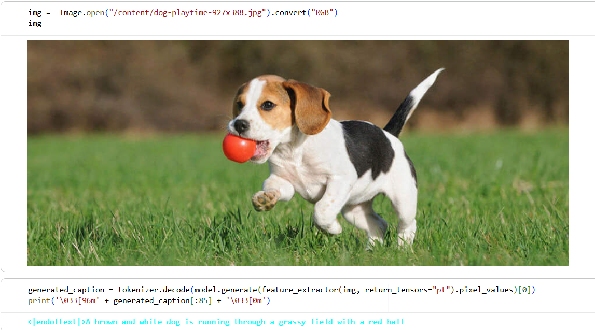
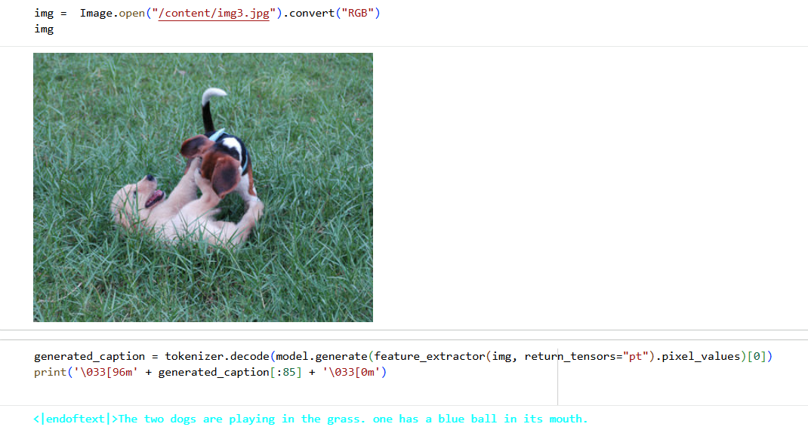
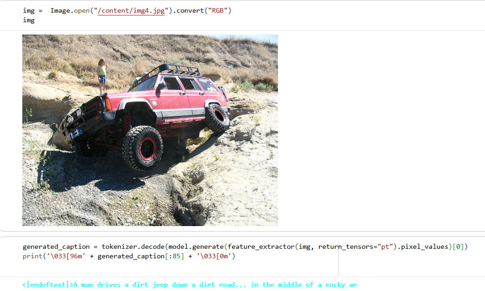

# 🖼️🔊 Audio Description of Images using Deep Learning

This project implements an end-to-end multimodal AI system that automatically generates text captions for images and converts them into natural-sounding audio descriptions. The system is designed to improve accessibility for visually impaired users by narrating the content of images using deep learning.

The work was published as a research paper at ICAITPR 2024 and combines Computer Vision, Natural Language Processing, and Speech Synthesis into a single pipeline.

# 🚀 Features

End-to-end pipeline: Image → Caption → Audio

Uses Vision Transformer (ViT) for image feature extraction

Uses GPT-2 as a decoder for caption generation

Converts generated captions to speech using Google Text-to-Speech (TTS)

Trained and evaluated on the Flickr8k dataset

Evaluated using BLEU-1 to BLEU-4 scores

Focused on real-world accessibility use cases

# 🧠 Architecture Overview

Image Preprocessing

Resize images to 224×224

Normalize and convert to tensors

Feature Extraction

Vision Transformer (ViT) encodes image into visual features

Caption Generation

GPT-2 takes visual features and generates textual descriptions

Text-to-Speech

Generated captions are converted into audio using Google TTS (WaveNet-based)

# 📊 Dataset

Flickr8k Dataset

8,000 images

(Due to GitHub file size limits, the dataset is not included.

Download it from: [Kaggle link: https://www.kaggle.com/datasets/adityajn105/flickr8k?select=Images])

40,000 captions (5 captions per image)

Split into:

6,000 training images

1,000 validation images

1,000 test images

# 🛠️ Tech Stack

Programming Language: Python

Deep Learning: PyTorch / TensorFlow (as used in your implementation)

Computer Vision: Vision Transformer (ViT)

NLP: GPT-2, Tokenization

Speech: Google Text-to-Speech (TTS)

Data Processing: NumPy, Pandas

Evaluation: BLEU-1, BLEU-2, BLEU-3, BLEU-4

# Outputs

## Example Output 1

## Example Output 2

## Example Output 3

# 📈 Results

The model was evaluated using BLEU scores and achieved:

BLEU-1: 73.1

BLEU-2: 48.7

BLEU-3: 35.9

BLEU-4: 23.3

These results outperformed baseline models such as CNN+LSTM and ResNet+GPT-2, demonstrating the effectiveness of the ViT + GPT-2 architecture for image captioning.

# ▶️ How to Run

1. Clone the repository:

git clone https://github.com/yourusername/audio-description-of-images.git
cd audio-description-of-images

2. Install dependencies:

pip install -r requirements.txt

3. Preprocess data:

python preprocessing/image_preprocess.py
python preprocessing/text_tokenizer.py

4. Train the model:

python training/train.py

5. Generate caption + audio:

python inference/generate_caption.py
python inference/text_to_speech.py

# 🎯 Use Cases

Accessibility tools for visually impaired users

Assistive AI systems

Multimedia content understanding

Human-centered AI applications

# 📄 Publication

This project was published as a research paper at:

2nd International Conference on Artificial Intelligence Trends and Pattern Recognition (ICAITPR 2024)
Audio Description of Images Using Deep Learning
